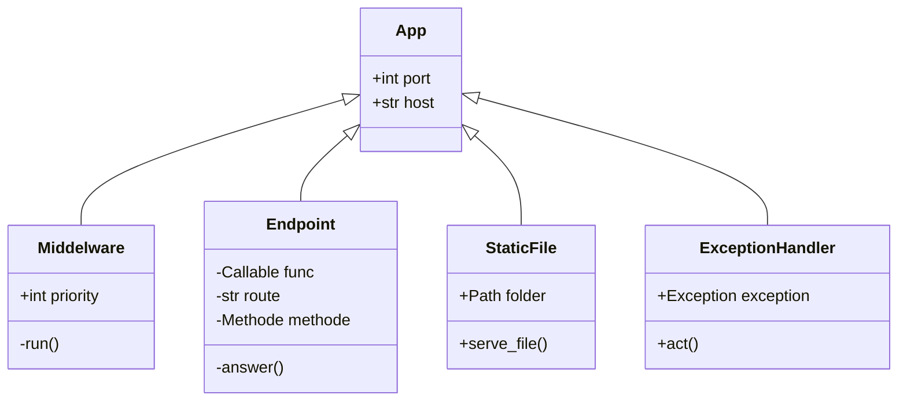

```mermaid
classDiagram
direction TB
    class App {
	    +int port
	    +str host
    }

    class Middelware {
	    +int priority
        -run()
    }

    class Endpoint {
	    -Callable func
	    -str route
        -Methode methode
        -answer()
    }

    class StaticFile {
	    +Path folder
	    +serve_file()
    }

    class ExceptionHandler {
	    +Exception exception
	    +act()
    }

    App <|-- Middelware
    App <|-- Endpoint
    App <|-- StaticFile
    App <|-- ExceptionHandler
```