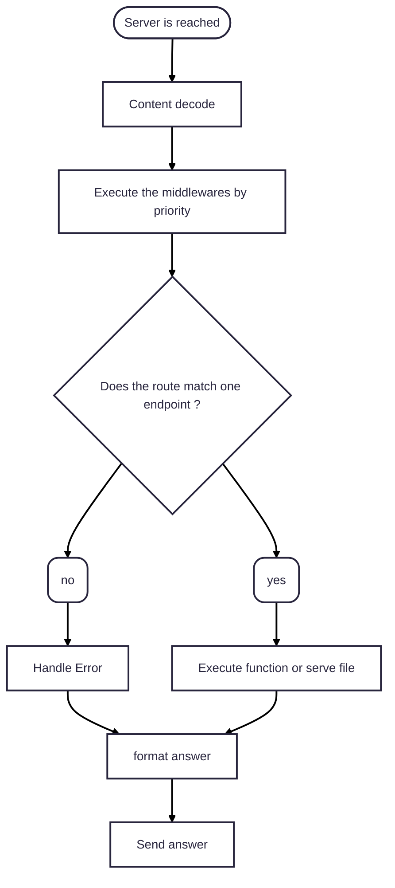

```mermaid
---
config:
  theme: redux
  layout: dagre
---
flowchart TD
    A(["Server is reached"]) --> B["Content decode"]
    B --> C["Execute the middlewares by priority"]
    C --> D{"Does the route match one endpoint ?"}
    D --> E("yes") & F("no")
    F --> G["Handle Error"]
    E --> H["Execute function or serve file"]
    G --> I["format answer"]
    H --> I
    I --> J["Send answer"]
```